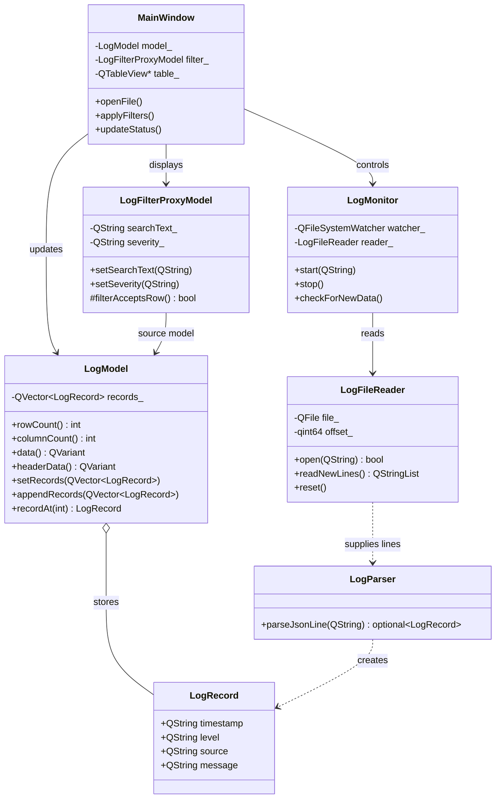

# Class diagram

Member names, types, visibility, and relationships follow the supplied class diagram. Signatures are design notation rather than complete C++ declarations.

```mermaid
classDiagram
    class MainWindow {
        -LogModel model_
        -LogFilterProxyModel filter_
        -QTableView* table_
        +openFile()
        +applyFilters()
        +updateStatus()
    }

    class LogFilterProxyModel {
        -QString searchText_
        -QString severity_
        +setSearchText(QString)
        +setSeverity(QString)
        #filterAcceptsRow() bool
    }

    class LogMonitor {
        -QFileSystemWatcher watcher_
        -LogFileReader reader_
        +start(QString)
        +stop()
        +checkForNewData()
    }

    class LogModel {
        -QVector~LogRecord~ records_
        +rowCount() int
        +columnCount() int
        +data() QVariant
        +headerData() QVariant
        +setRecords(QVector~LogRecord~)
        +appendRecords(QVector~LogRecord~)
        +recordAt(int) LogRecord
    }

    class LogFileReader {
        -QFile file_
        -qint64 offset_
        +open(QString) bool
        +readNewLines() QStringList
        +reset()
    }

    class LogParser {
        +parseJsonLine(QString) optional~LogRecord~
    }

    class LogRecord {
        +QString timestamp
        +QString level
        +QString source
        +QString message
    }

    MainWindow --> LogFilterProxyModel : displays
    MainWindow --> LogModel : updates
    MainWindow --> LogMonitor : controls
    LogFilterProxyModel --> LogModel : source model
    LogMonitor --> LogFileReader : reads
    LogModel o-- LogRecord : stores
    LogFileReader ..> LogParser : supplies lines
    LogParser ..> LogRecord : creates
```
